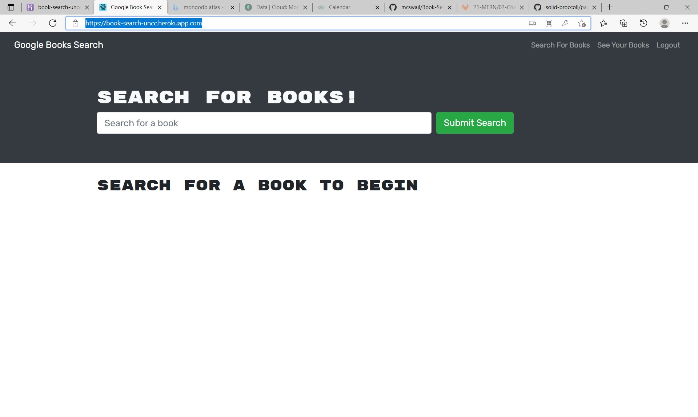

## 21 MERN: Book Search Engine
My challenge this week was to learn that most modern websites are driven by two things: data and user demands. This was not a surprise, personalizing user data is the cornerstone of real-world web development today. 
This past week, I took a fully functioning Google Books API search engine built with a RESTful API, and refactor it to be a GraphQL API built with Apollo Server. My app was built using the MERN (MongoDB Express React Node) stack, with a React front end, MongoDB database, and Node.js/Express.js server and API. My starter code was already set up to allow users to save book searches to the back end.
To be succesful in this challenge I had accomplish the following steps:

1. Set up an Apollo Server to use GraphQL queries and mutations to fetch and modify data, replacing the existing RESTful API.

2. Modify the existing authentication middleware so that it works in the context of a GraphQL API.

3. Use Apollo Client to create an Apollo Provider so that requests can communicate with an Apollo Server.

4. Deploy the application to Heroku using a MongoDB database hosted at MongoDB Atlas.

##### Table of Contents  
[Headers](#headers)  
[Emphasis](#emphasis)  
...snip...    
<a name="headers"/>
## Headers

## User Story
AS AN avid reader
I WANT to search for new books to read
SO THAT I can keep a list of books to purchase

## Acceptance Criteria
GIVEN a book search engine
WHEN I load the search engine
THEN I am presented with a menu with the options Search for Books and Login/Signup and an input field to search for books and a submit button
WHEN I click on the Search for Books menu option
THEN I am presented with an input field to search for books and a submit button
WHEN I am not logged in and enter a search term in the input field and click the submit button
THEN I am presented with several search results, each featuring a book’s title, author, description, image, and a link to that book on the Google Books site
WHEN I click on the Login/Signup menu option
THEN a modal appears on the screen with a toggle between the option to log in or sign up
WHEN the toggle is set to Signup
THEN I am presented with three inputs for a username, an email address, and a password, and a signup button
WHEN the toggle is set to Login
THEN I am presented with two inputs for an email address and a password and login button
WHEN I enter a valid email address and create a password and click on the signup button
THEN my user account is created and I am logged in to the site
WHEN I enter my account’s email address and password and click on the login button
THEN I the modal closes and I am logged in to the site
WHEN I am logged in to the site
THEN the menu options change to Search for Books, an option to see my saved books, and Logout
WHEN I am logged in and enter a search term in the input field and click the submit button
THEN I am presented with several search results, each featuring a book’s title, author, description, image, and a link to that book on the Google Books site and a button to save a book to my account
WHEN I click on the Save button on a book
THEN that book’s information is saved to my account
WHEN I click on the option to see my saved books
THEN I am presented with all of the books I have saved to my account, each featuring the book’s title, author, description, image, and a link to that book on the Google Books site and a button to remove a book from my account
WHEN I click on the Remove button on a book
THEN that book is deleted from my saved books list
WHEN I click on the Logout button
THEN I am logged out of the site and presented with a menu with the options Search for Books and Login/Signup and an input field to search for books and a submit button  

## Mock-Up  and screenshot of my deployed application

# Back-End Specifications
I was provided the following tasks for each of my back-end files:

1. auth.js: Update the auth middleware function to work with the GraphQL API.

2. server.js: Implement the Apollo Server and apply it to the Express server as middleware.

## My Schemas directory:

1. index.js: Export your typeDefs and resolvers.

2. resolvers.js: Define the query and mutation functionality to work with the Mongoose models.

3. typeDefs.js: Define the necessary Query and Mutation types:

## My Query type:

1. me: Which returns a User type.

## My Mutation type:

1. login: Accepts an email and password as parameters; returns an Auth type.

2. addUser: Accepts a username, email, and password as parameters; returns an Auth type.

3. saveBook: Accepts a book author's array, description, title, bookId, image, and link as  parameters; returns a User type. (Look into creating what's known as an input type to handle all of these parameters!)

4. removeBook: Accepts a book's bookId as a parameter; returns a User type.

## My User type:

_id
username
email
bookCount
savedBooks (This will be an array of the Book type.)

## My Book type:

bookId (Not the _id, but the book's id value returned from Google's Book API.)
authors (An array of strings, as there may be more than one author.)
description
title
image
link

## My Auth type:

token
user (References the User type.)

## My Front-End Specifications
You'll need to create the following front-end files:

1. queries.js: This will hold the query GET_ME, which will execute the me query set up using Apollo Server.

2. mutations.js:

3. LOGIN_USER will execute the loginUser mutation set up using Apollo Server.

4. ADD_USER will execute the addUser mutation.

5. SAVE_BOOK will execute the saveBook mutation.

6. REMOVE_BOOK will execute the removeBook mutation.

Additionally, I had to complete the following tasks in each of my front-end files:

1. App.js: Using ApolloClient, InMemoryCache, createHttpLink, and setContext from the Apollo Client library, create an Apollo Provider to make every request work with the Apollo server.

2. SearchBooks.js:
Use the Apollo useMutation() Hook to execute the SAVE_BOOK mutation in the handleSaveBook() function instead of the saveBook() function imported from the API file. Define and export the SAVE_BOOK mutation in a new file at /client/src/utils/mutations.js.

3. SavedBooks.js:

4. Remove the useEffect() Hook that sets the state for UserData.
Instead, use the useQuery() Hook to execute the GET_ME query on load and save it to a variable named userData. Define and export the GET_ME query in a new file at /client/src/utils/queries.js.

5. Use the useMutation() Hook to execute the REMOVE_BOOK mutation in the handleDeleteBook() function instead of the deleteBook() function that's imported from API file. Define and export the REMOVE_BOOK mutation in a new file at /client/src/utils/mutations.js. (Make sure you keep the removeBookId() function in place!)

6. SignupForm.js: Replace the addUser() functionality imported from the API file with the ADD_USER mutation functionality. Define and export the ADD_USER mutation in a new file at /client/src/utils/mutations.js.

7. LoginForm.js: Replace the loginUser() functionality imported from the API file with the LOGIN_USER mutation functionality. Define and export the LOGIN_USER mutation in a new file at /client/src/utils/mutations.js.

## Links to my GitHub repo and my deployed App.

https://book-search-uncc.herokuapp.com/ application on Heroku.

https://github.com/mcswajl/Book-Search-21 GitHub repository.

## Contact
Joshua L. McSwain
joshua.mcswain@mecklenburgcountync.gov
